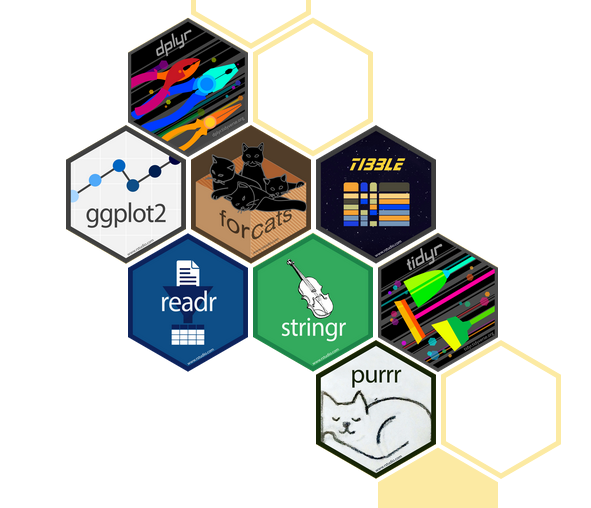

class: middle, center, inverse, hide-logo

# 2 Introduction to the `tidyverse`

---

background-image: url(https://www.tidyverse.org/images/hex-tidyverse.png)
background-position: 97.5% 2.5%
background-size: 7.5%
layout: true

---

## 2.1 What is the `tidyverse`?

> The tidyverse is an opinionated collection of R packages designed for data science. All packages share an underlying design philosophy, grammar, and data structures. ~ [tidyverse.org](https://www.tidyverse.org/)


> Its primary goal is to facilitate a conversation between a human and a computer about data.  
~ [Wickham, et al. (2019)](https://joss.theoj.org/papers/10.21105/joss.01686)

.pull-left[.center[
```{r, echo=F, out.width='45%', out.height='45%'}
knitr::include_graphics("https://www.tidyverse.org/images/hex-tidyverse.png")
```

Official `tidyverse` [Hex Sticker](https://github.com/rstudio/hex-stickers)
]]
.pull-right[.center[
```{r, echo=F, out.width='50%', out.height='50%'}
knitr::include_graphics("https://pbs.twimg.com/profile_images/905186381995147264/7zKAG5sY.jpg")
```

Hadley Wickham - Chief Scientist @ RStudio,  
[Founding Father](https://twitter.com/hadleywickham/status/959507805282582528?s=20) of the `tidyverse`
]]

???
- Can also be seen as a philosophy of how to write code in R. Its a dialect.
- Many people in the community argue that this dialect should be incorporated in base R.
- Often when googling for specific solutions and reading the stackoverflow answers, you may find solutions which can be implemented using plain `base R` or using the `tidyverse` syntax.

---

## 2.1 What is the `tidyverse`?

> The tidyverse is an opinionated **collection of R packages** designed for data science. All packages share an underlying design philosophy, grammar, and data structures. ~ [tidyverse.org](https://www.tidyverse.org/)

.pull-left[
**`tidyverse` core packages:**
- `readr`: data import
- `tibble`: modern data frame object
- `stringr`: working with strings
- `forcats`: working with factors
- `tidyr`: data tidying
- `dplyr`: data manipulation
- `ggplot2`: data visualization
- `purrr`: functional programming
]
.pull-right[
```{r, echo=F, out.width='90%', out.height='90%', fig.align='center'}

```
]

???
- Tidyverse can be viewed as a meta-package
- each package has its own goal which makes the tidyverse a modular collection of packages
- these are the core packages (there are many others for special purposes which integrate seamlessly, e.g., lubridate, stringr, forcats, ...)

---

## 2.1 What is the `tidyverse`?

> The tidyverse is an opinionated **collection of R packages** designed for data science. All packages share an underlying design philosophy, grammar, and data structures. ~ [tidyverse.org](https://www.tidyverse.org/)

```{r, eval=F}
install.packages("tidyverse")
library(tidyverse)
```
```
-- Attaching packages --------------------------------------- tidyverse 1.3.1 --
v ggplot2 3.3.5     v purrr   0.3.4
v tibble  3.1.4     v dplyr   1.0.7
v tidyr   1.1.3     v stringr 1.4.0
v readr   2.0.1     v forcats 0.5.1
-- Conflicts ------------------------------------------ tidyverse_conflicts() --
x dplyr::filter() masks stats::filter()
x dplyr::lag()    masks stats::lag()
```

.footnote[
*Note that `install.packages("tidyverse")` is essentially equivalent to running `install.packages("ggplot2")`, `install.packages("tibble")`, `install.packages("tidyr")`, `install.packages("readr")`, etc. individually.*
]

???
- see tidyverse package version as well as the version of the eight core packages
- the eight core packages are loaded by loading the `tidyverse` package
- note that some `base R` functions (`stats` namespace) are overwritten by their `tidyverse` equivalents (`dplyr` namespace)
- when working with a new or rarely used package, i prefer to explicitly state the namespace to remember where the function is coming from 

---

## 2.1 What is the `tidyverse`?

> The tidyverse is an opinionated collection of R packages designed **for data science**. All packages share an underlying design philosophy, grammar, and data structures. ~ [tidyverse.org](https://www.tidyverse.org/)

These packages are geared towards facilitating the day-2-day data science workflow:

```{r, echo=F, out.width='60%', out.height='60%', out.extra='style="float:left; padding:20px"'}
knitr::include_graphics("https://d33wubrfki0l68.cloudfront.net/571b056757d68e6df81a3e3853f54d3c76ad6efc/32d37/diagrams/data-science.png")
```

<br>

**Import:** `readr`  
**Tidy:** `tidyr`  
**Transform:** `dplyr`, `forcats`, `stringr`  
**Visualize:** `ggplot2`  
**Model:** `tidymodels`  
**Communicate:** `rmarkdown`  
**Program:** `magrittr`, `purrr`, `tibble`

.footnote[
*Source: [Wickham/Grolemund (2017)](https://r4ds.had.co.nz/tidy-data.html).*

*Note: For the communication and modeling part of the workflow refer to the `rmarkdown` and `tidymodels` videos.*
]

???
workflow here as stylized example

---

## 2.1 What is the `tidyverse`?

> The tidyverse is an opinionated collection of R packages designed for data science. All packages share an **underlying design philosophy, grammar, and data structures**. ~ [tidyverse.org](https://www.tidyverse.org/)

This underlying design philosophy and grammar boils down to a consistent and easy-to-use API:

- The `tibble` as the core underlying data structure
- Extensive use of the `%>%`-operator for gluing together multiple function calls
- Consistently applied naming conventions (e.g., function names in [*snakecase*](https://raw.githubusercontent.com/allisonhorst/stats-illustrations/master/other-stats-artwork/coding_cases.png))
- Consistent order of function arguments (e.g., `fn(arg1 = data, arg2 = col names, ...)`)
- ...

--

The `tidyverse` syntax can be viewed as a "dialect" of `R`. When you have familiarized yourself with it, you will be able to easily transfer your knowledge about one function or package to other components of the `tidyverse`. Just like learning a new language.

.footnote[
*Note: For further information see [Tidyverse Team (2020)](https://design.tidyverse.org/) and [Wickham (2019)](https://cran.r-project.org/web/packages/tidyverse/vignettes/manifesto.html).*
]

???
- API: application programming interface
- R data structures: atomic vector (character, integer, numeric, logical, complex), list, matrix, data frame, factors -> tibble simply an extension/better version of the data frame
- snakecase: underscores, numbers and lowercase characters
