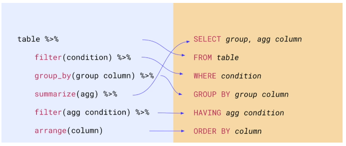

class: middle, center, inverse
layout: false

# 4.5 `dplyr`:<br><br>A Grammar of Data Manipulation

---

background-image: url(https://raw.githubusercontent.com/tidyverse/dplyr/master/man/figures/logo.png)
background-position: 97.5% 2.5%
background-size: 7.5%
layout: true

---

## 4.5 `dplyr`: A Grammar of Data Manipulation

`dplyr` provides a set of functions for manipulating data frame objects (e.g., `tibbles`) while relying on a consistent grammar. Functions are intuitively represented by "verbs" that reflect the underlying operations and always output a new or modified `tibble`.

**Operations on rows:**
- `filter()` picks rows that meet one or several logical criteria
- `slice()` picks rows based on their location in the data
- `arrange()` changes the order of rows

**Operations on columns:**
- `select()` picks respectively drops certain columns
- `rename()` changes the column names
- `relocate()` changes the order of columns
- `mutate()` transforms the column values and/or creates new columns

**Operations on grouped data:**
- `group_by()` partitions data based on one or several columns
- `summarise()` reduces a group of data into a single row

---

## 4.5 `dplyr`: A Grammar of Data Manipulation

```{r, echo=F, out.height='40%', out.width='40%', dpi=100, out.extra='style="float:right; padding:10px"'}
knitr::include_graphics(
  "https://raw.githubusercontent.com/allisonhorst/stats-illustrations/master/rstats-artwork/dplyr_filter.jpg"
)
```

**Operations on rows:** `filter()` picks rows that meet one or several logical criteria

Filter for all penguins of `species` "Adelie".
```{r, eval=F}
penguins %>% 
  filter(species == "Adelie")
```

Filter for all penguins with a missing value in the `bill_length_mm` measurement.
```{r, eval=F}
penguins %>% 
  filter(is.na(bill_length_mm) == T)
  # filter(!is.na(bill_length_mm) == F)
```

Filter for all penguins observed prior to `year` 2008 or subsequent to `year` 2008 and where the body mass (`body_mass_g`) lies between 3,800 and 4,000 grams.
```{r, eval=F}
penguins %>% 
  filter(between(body_mass_g, 3800, 4000) & (year < 2008 | year > 2008))
```

???
 - Note that using `=` instead of `==` is a common mistakes for beginners (`<-` = `=`).

---

## 4.5 `dplyr`: A Grammar of Data Manipulation

**Operations on rows:** `slice()` picks rows based on their location in the data

.panelset[
.panel[.panel-name[slide()]
Pick rows based on their index.
```{r}
penguins %>% 
  slice(23:27)
```
]
.panel[.panel-name[slice_head()]
Pick the first `n` rows (vice versa for `slice_tail()`).
```{r}
penguins %>% 
  slice_head(n = 5)  # alternatively: slice_head(frac = 0.05)
```
]
.panel[.panel-name[slice_sample()]
Pick a random sample of `n` rows (with or without replacement).
```{r}
penguins %>% 
  slice_sample(n = 5)
```
]
.panel[.panel-name[slice_min()]
Pick the `n` rows with the largest value (vice versa for `slice_min()`).
```{r}
penguins %>% 
  slice_max(bill_length_mm, n = 5)
```
]
]

???
- slice_sample to generate bootstrapped samples

---

## 4.5 `dplyr`: A Grammar of Data Manipulation

**Operations on rows:** `arrange()` changes the order of rows

.panelset[
.panel[.panel-name[Ascending]
Return the five penguins with the smallest body mass.
```{r}
penguins %>% 
  arrange(body_mass_g) %>% 
  slice_head(n = 5)  # equivalent to: slice_min(body_mass_g, n = 3)
```
]
.panel[.panel-name[Descending]
Return the five penguins with the highest body mass.
```{r}
penguins %>% 
  arrange(desc(body_mass_g)) %>% 
  slice_head(n = 5)  # equivalent to: slice_max(body_mass_g, n = 3)
```
]
]

???
- arrange by default always sorts from smallest to largest

---

## 4.5 `dplyr`: A Grammar of Data Manipulation

**Operations on columns:** `select()` picks respectively drops certain columns

.panelset[
.panel[.panel-name[select() by index]
```{r}
penguins %>% 
  select(1:3) %>% 
  glimpse
```
]
.panel[.panel-name[select() by name]
```{r}
penguins %>% 
  select(species, island, bill_length_mm) %>% 
  glimpse
```
]
]

---

## 4.5 `dplyr`: A Grammar of Data Manipulation

**Operations on columns:** `select()` picks respectively drops certain columns (using `tidyselect` helpers)

.panelset[
.panel[.panel-name[everything()]
Select all columns.
```{r}
penguins %>% 
  select(everything()) %>% 
  glimpse
```
]
.panel[.panel-name[last_col()]
Select the last column in the data frame.
```{r}
penguins %>% 
  select(last_col()) %>% 
  glimpse
```
]
.panel[.panel-name[starts_with()]
Select columns which names start with a certain string.
```{r}
penguins %>% 
  select(starts_with("bill")) %>% 
  glimpse
```
]
.panel[.panel-name[ends_with()()]
Select columns which names end with a certain string.
```{r}
penguins %>% 
  select(ends_with("mm")) %>% 
  glimpse
```
]
.panel[.panel-name[contains()]
Select columns which name contains a certain string.
```{r}
penguins %>% 
  select(contains("e") & contains("a")) %>% 
  glimpse
```
]
.panel[.panel-name[machtes()]
Select columns based on a regular expression ([regex](https://www.rexegg.com/regex-quickstart.html)).
```{r}
penguins %>% 
  select(matches("_\\w*_mm$")) %>% 
  glimpse
```
]
.panel[.panel-name[where()]
Select columns for which a function evaluates to `TRUE`.
```{r}
penguins %>% 
  select(where(is.numeric)) %>% 
  glimpse
```
]
]

---

## 4.5 `dplyr`: A Grammar of Data Manipulation

**Operations on columns:** `select()` picks respectively drops certain columns

Which columns are returned by the following queries?

```{r, eval=F}
penguins %>% 
  select(starts_with("s"))
```

```{r, eval=F}
penguins %>% 
  select(ends_with("mm"))
```

```{r, eval=F}
penguins %>% 
  select(contains("mm"))
```

```{r, eval=F}
penguins %>% 
  select(-contains("mm"))
```

```{r, eval=F}
penguins %>% 
  select(where(~ is.numeric(.))) %>%  # equivalent to: select(where(is.numeric))
  select(where(~ mean(., na.rm = T) > 1000))
```

???
deselect:
- if you want to deselect something put a minus in front
where:
- feed a function that takes a vector and returns T or F
- when using a function within another function you usually require the formula (~) notation (see `purrr` part), except when only using a function with one argument

---

## 4.5 `dplyr`: A Grammar of Data Manipulation

**Operations on columns:** `rename()` changes the column names

Change the name of the column `body_mass_g` (`sex`) to `bm` (`gender`).
```{r}
penguins %>% rename(bm = body_mass_g, gender = sex) %>% 
  colnames()
```
Convert the name of the columns that include the string `"mm"` to upper case.
```{r}
penguins %>% rename_with(.fn = toupper, .cols = contains("mm")) %>% 
  colnames()
```

---

## 4.5 `dplyr`: A Grammar of Data Manipulation

```{r, echo=F, out.height='40%', out.width='40%', dpi=100, out.extra='style="float:right; padding:10px"'}
knitr::include_graphics(
  "https://raw.githubusercontent.com/allisonhorst/stats-illustrations/master/rstats-artwork/dplyr_relocate.png"
)
```

**Operations on columns:** `relocate()` changes the order of columns

Change the order of columns in the `tibble` according to the following scheme:
1. place `species` after `body_mass_g`
2. place `sex` before `species`
3. place `island` at the end

```{r}
penguins %>% 
  relocate(species, .after = body_mass_g) %>%
  relocate(sex, .before = species) %>%
  relocate(island, .after = last_col()) %>%
  colnames()
```


---

## 4.5 `dplyr`: A Grammar of Data Manipulation

**Operations on columns:** `mutate()` transforms the column values and/or creates new columns

Create a new `bm_kg` variable which reflects `body_mass_g` measured in kilo grams.
```{r}
penguins %>% 
  mutate(bm_kg = body_mass_g / 1000, .keep = "all", after = island) %>% 
  slice_head(n = 5)
```

- Use the `.keep` argument to specify which columns to keep after manipulation.
- Use the `.before`/`.after` arguments to specify the position of the new column.
- For overriding a given column simply use the same column name.
- For keeping only the new column use `dplyr::transmute()`.

---

## 4.5 `dplyr`: A Grammar of Data Manipulation

```{r, echo=F, out.height='40%', out.width='40%', dpi=100, out.extra='style="float:right; padding:10px"'}
knitr::include_graphics(
  "https://raw.githubusercontent.com/allisonhorst/stats-illustrations/master/rstats-artwork/dplyr_case_when.png"
)
```

**Operations on columns:** `mutate()` transforms the column values and/or creates new columns

Create a *one-hot encoded* variable for `sex`.
```{r}
penguins %>% 
  mutate(
    sex_binary = case_when(
      sex == "male" ~ 1,
      sex == "female" ~ 0),
    .keep = "all", .after = island
  ) %>% 
  slice_head(n = 3)
```

.pull-right[.pull-right[.footnote[
_**One-hot Encoding:** Encoding a categorical variable with `C` factor levels into `C` dummies (often in modeling you create `C-1` dummies otherwise you have a perfect linear combination of the variables)._
]]]

???
case_when:
- vectorized version of if_else
- two-sided formulas: LHS tests the condition, RHS specifies the replacement value
- for unmatched cases, the function returns NA
- use LHS `TRUE` to capture all cases not explicitly specified beforehand

---

## 4.5 `dplyr`: A Grammar of Data Manipulation

```{r, echo=F, out.height='40%', out.width='40%', out.extra='style="float:right; padding:10px"'}
knitr::include_graphics(
  "https://raw.githubusercontent.com/allisonhorst/stats-illustrations/master/rstats-artwork/dplyr_across.png"
)
```

**Operations on columns:** `mutate()` transforms the column values and/or creates new columns

Transform measurement variables to meters.
```{r}
penguins %>% 
  mutate(
    across(contains("mm"), ~ . / 1000),
    .keep = "all"
  ) %>% 
  slice_head(n = 3)
```

???
across:
- apply same transformation across multiple columns
- allows you to use the semantics you know from the `select()` function
- does not require you to explicitly specify a column name as it only transform existing columns

---

## 4.5 `dplyr`: A Grammar of Data Manipulation

```{r, echo=F, out.height='40%', out.width='40%', dpi=100, out.extra='style="float:right; padding:10px"'}
knitr::include_graphics(
  "https://raw.githubusercontent.com/allisonhorst/stats-illustrations/master/rstats-artwork/dplyr_across.png"
)
```

**Operations on columns:** `mutate()` transforms the column values and/or creates new columns

Define `species`, `island` and `sex` as a categorical variable, i.e. *factors*, using `across()`.
```{r}
penguins %>% 
  mutate(
    across(where(is.character), as.factor),
    .keep = "all"
  ) %>% 
  slice_head(n = 3)
```

---

## 4.5 `dplyr`: A Grammar of Data Manipulation

**Operations on grouped data:** `group_by()` partitions data based on one or several columns

```{r}
penguins %>% group_by(species)
```

Use `group_keys()`, `group_indices()` and `group_vars()` to access grouping keys, group indices per row and grouping variables.

---

## 4.5 `dplyr`: A Grammar of Data Manipulation

**Operations on grouped data:** `group_by()` partitions data based on one or several columns

Under the hood `group_by()` changes the representation of the `tibble` and transforms it into a grouped data frame (`grouped_df`). This allows us to operate on the subgroups individually using `summarise()`.

--

**Operations on grouped data:** `summarise()` reduces a group of data into a single row


.panelset[
.panel[.panel-name[univariate]
```{r}
penguins %>% group_by(species) %>% summarise(count = n(), .groups = "drop")
```
]
.panel[.panel-name[bivariate]
```{r}
penguins %>% group_by(species, sex) %>% summarise(count = n(), .groups = "drop")
```
]
]

???
- use `.groups = ` to indicate what happens to the groups after summarising them

---

## 4.5 `dplyr`: A Grammar of Data Manipulation

**Operations on grouped data:** `group_by()` partitions data based on one or several columns and `summarise()` reduces a group of data into a single row

```{r}
penguins %>%
  group_by(species) %>%
  summarise(
    across(contains("mm"), ~ mean(., na.rm = T), .names = "{.col}_avg"),
    .groups = "drop"
  )
```

Using `group_by()`, followed by `summarise()` and `ungroup()` reflects the **split-apply-combine paradigm** in data analysis: Split the data into partitions, apply some function to the data and then merge the results.

???
- the true potential is unleashed if you combine `group_by` and `summarise`
- split-apply-combine paradigm particularly useful in parallel processing

---

## 4.5 `dplyr`: A Grammar of Data Manipulation

**Operations on grouped data:** `group_by()` partitions data based on one or several columns and `summarise()` reduces a group of data into a single row

```{r, echo=F, out.height='60%', out.width='60%', out.extra='style="float:left; padding:10px"', dpi=100}
knitr::include_graphics("https://raw.githubusercontent.com/allisonhorst/stats-illustrations/master/rstats-artwork/group_by_ungroup.png")
```
<br>
*Note: Instead of using `ungroup()` you may also set the `.groups` argument in `summarise()` equal to "drop".*

*But never forget to ungroup your data, otherwise you may run into errors later on in your analysis!*

???
- now lets look at some more advanced use cases

---

## 4.5 `dplyr`: A Grammar of Data Manipulation

**Stacked `group_by()`:** Use `.add = T` to add new grouping variables (otherwise the first is overridden)

```{r}
penguins %>% 
  group_by(species) %>% 
  group_by(year, .add = T)   # equivalent to group_by(species, year)
```

---

## 4.5 `dplyr`: A Grammar of Data Manipulation

**Apply multiple summary functions:** Provide a list of `purrr`-style functions to `across()`

```{r}
penguins %>%
  group_by(species) %>%
  summarise(
    across(
      contains("mm"),
      list(avg = ~ mean(., na.rm = T), sd = ~ sd(., na.rm = T)),
      .names = "{.col}_{.fn}"
    ),
    .groups = "drop"
  )
```

---

## 4.5 `dplyr`: A Grammar of Data Manipulation

**Changed behavior of `mutate()`:** Summary functions, e.g., `mean()` or `sd()` now operate on partitions of the data instead of on the whole data

```{r}
penguins %>%
  group_by(species) %>% 
  mutate(stand_bm = (body_mass_g - mean(body_mass_g, na.rm = T)) / sd(body_mass_g, na.rm = T)) %>% 
  glimpse
```

???
- here example of the z-transformation on a group level

---

## 4.5 `dplyr`: A Grammar of Data Manipulation

**`group_by()` a transformed column:** Provide a `mutate()`-like expression in your `group_by()` statement

```{r}
bm_breaks <- mean(penguins$body_mass_g, na.rm = T) - (-3:3) * sd(penguins$body_mass_g, na.rm = T)

penguins %>% 
  group_by(species, bm_bin = cut(body_mass_g, breaks = bm_breaks)) %>%
  summarise(count = n(), .groups = "drop")
```

???
1. compute bins for body mass, the amount of standard deviations from the mean
2. group by data according to these bins (create bins in `group_by()` command)

---

## 4.5 `dplyr`: A Grammar of Data Manipulation

**Changed behavior of `filter()`:** Filters now operate on partitions of the data instead of on the whole data

```{r}
penguins %>% 
  group_by(species, island) %>% 
  filter(flipper_length_mm == max(flipper_length_mm, na.rm = T))
```

???
- Group by all unique `species`-`island` combinations and filter for the penguins with the maximal flipper length per combination

---

## 4.5 `dplyr`: A Grammar of Data Manipulation

**Nesting of grouped data:** Usually, you will find it more intuitive to use `group_by()` followed by `nest()` to produce a nested data frame compared to the example in [section 4.4](#tidyr_nest).

```{r}
penguins %>% 
  group_by(species, year) %>% 
  tidyr::nest()
```

.footnote[
*Note: Find more information about `group_by()` by running `vignette("grouping")`.*
]

---

## 4.5 `dplyr`: A Grammar of Data Manipulation

**Other selected `dplyr` operations:**

.panelset[
.panel[.panel-name[distinct()]
**`distinct()`** selects only unique rows
```{r}
penguins %>% 
  distinct(species, island)
```
]
.panel[.panel-name[pull()]
**`pull()`** extracts single columns as vectors
```{r, echo=F}
options(max.print=100)
```
```{r}
penguins %>% 
  pull(year)  # equivalent to: penguins$year
```
```{r, echo=F}
options(max.print=1000)
```

]
.panel[.panel-name[if_else()]
**`if_else()`** applies a vectorized if-else-statement
```{r}
penguins %>% select(species, island, body_mass_g) %>% 
  mutate(penguin_size = if_else(body_mass_g < 3500, "tiny penguin", "big penguin"))
```
]
.panel[.panel-name[lag()]
**`lag()`** shifts column values by an offset of `n` forward
```{r}
penguins %>% select(species, body_mass_g) %>% 
  mutate(lagged_bm = lag(body_mass_g, n = 1))
```
]
.panel[.panel-name[lead()]
**`lead()`** shifts column values by an offset of `n` backward
```{r}
penguins %>% select(species, body_mass_g) %>% 
  mutate(lead_bm = lead(body_mass_g, n = 2))
```
]
.panel[.panel-name[join()]
**`left_join()`, `right_join()`, `inner_join()`** and __`full_join()`__ enable to merge different data frames by matching rows based on keys (similar to joins performed in SQL).
]
]

.pull-right[.pull-right[.footnote[
*Note: Find more information about `dplyr` by running `vignette("dplyr")` and consulting the official [cheat sheet](https://raw.githubusercontent.com/rstudio/cheatsheets/master/data-transformation.pdf).*
]]]

---

## 4.5 `dplyr`: A Grammar of Data Manipulation

.center[**Similarities between `dplyr` and `SQL` statements:**]

```{r, echo=F, out.width='70%', out.height='70%', fig.align='center'}

```

.center[
*Src: [Steves (2021)](https://www.rstudio.com/resources/rstudioglobal-2021/the-dynamic-duo-sql-and-r/)*
]
